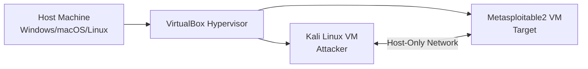
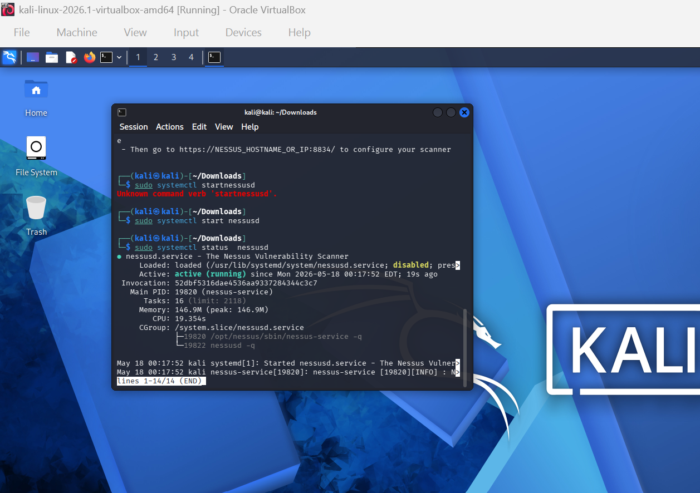
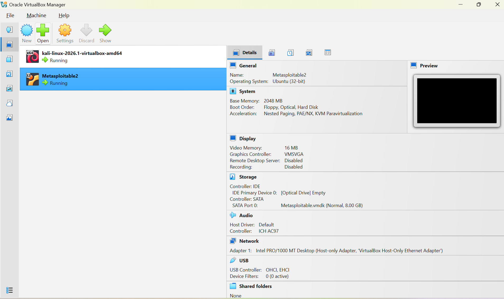
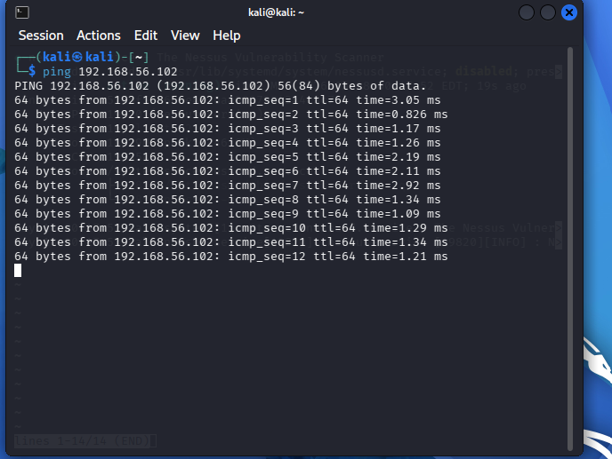

# Project 1 – Penetration Testing Lab Setup

## 1. Overview of Technology Stack

This penetration testing lab is built using a local host machine running a Type‑2 hypervisor to virtualize two separate environments: a Kali Linux attacker machine and a Metasploitable2 vulnerable target machine. The hypervisor manages networking between the two VMs using a Host‑Only Adapter, allowing isolated communication for penetration‑testing activities. Kali Linux is used as the primary offensive security distribution, while Metasploitable2 provides intentionally vulnerable services for testing.

## 2. Architectural Diagram

## 3. Screenshot of Virtualization Environment

Inserted screenshot showing both Kali Linux and Metasploitable2 running inside VirtualBox.

- Suggestion: save image as `screenshots/virtualbox.png` and insert below:

## 4. Screenshot of Running Kali Linux

Inserted screenshot showing the Kali desktop with a terminal open and you logged in.

.png)

## 5. Screenshot Showing Nessus Installed

Inserted screenshot of the Nessus Essentials dashboard at https://localhost:8834.

## 6. Screenshot of Running Metasploitable2

Inserted screenshot showing the Metasploitable2 login shell.

## 7. Screenshot Showing Kali Can Ping Metasploitable2

Inserted screenshot of the successful ping to `192.168.56.102` from Kali Linux.

## 8. Problems Encountered and How They Were Solved

- **Incorrect Nessus download URL:** Initial attempts to download the `.deb` package resulted in 404 errors. Resolved by selecting the correct platform (Debian/Kali) on the Tenable website.
- **Opening the `.deb` instead of installing it:** Double‑clicking the file opened it in an archive viewer. The correct installation was performed using `sudo dpkg -i Nessus-*.deb`.
- **Nessus interface showing security warning:** Firefox displayed a certificate warning when accessing `https://localhost:8834`. Resolved by selecting “Advanced” → “Accept the Risk and Continue.”
- **New Scan button greyed out:** Nessus required time to initialize and compile plugins. After waiting several minutes and refreshing the page, the button became available.
- **Networking between VMs:** Ensuring both VMs were on the same Host‑Only network allowed successful communication. The Metasploitable2 IP was identified using `ifconfig`, and connectivity was confirmed via `ping` from Kali.

## Final Notes

This lab environment is now fully operational and ready for penetration‑testing exercises in future assignments. All required components—Kali Linux, Metasploitable2, and Nessus—are installed, configured, and verified to communicate successfully.
