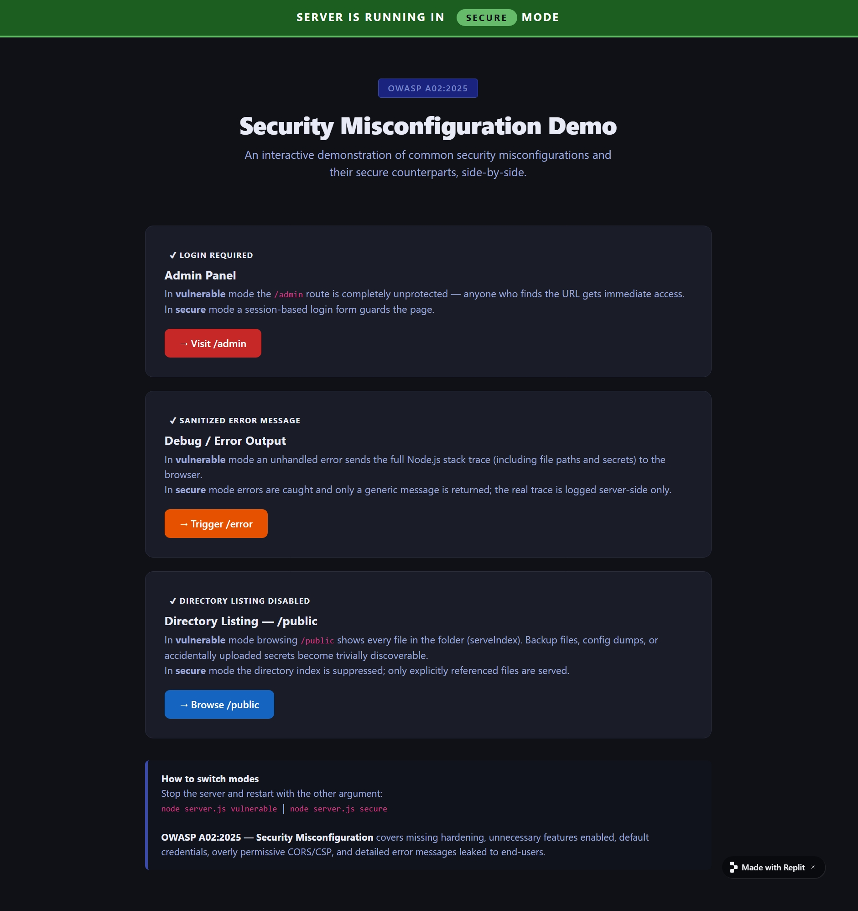

# 📄 Vibe Coding Assignment — Week 5  
## OWASP A02:2025 — Security Misconfiguration

### 🔗 Live Demo  
https://1351621e-3a22-4bf4-a0df-36d680abba57-00-1g72q76s866ac.picard.replit.dev/

---

# 1. Overview: Vibe Coding Tool Chosen

For this assignment, I used **Replit** as my Vibe Coding environment. I chose Replit because:

- It allows instant prototyping without installing anything locally  
- It automatically hosts the app with a public URL  
- It supports Node.js + Express easily  
- It makes it simple to test vulnerable vs. secure configurations  
- It provides a clean UI for testing routes like `/admin`, `/env`, and `/error`

Replit made it easy to toggle between **vulnerable** and **secure** modes and visually demonstrate the impact of misconfigurations.

---

# 2. Description of My Program

I built an educational web application called:

## **“Security Misconfiguration Demo”**

The app demonstrates how **Security Misconfiguration** happens when developers:

- Leave admin panels unprotected  
- Enable debug mode in production  
- Allow directory listing  
- Expose environment variables  
- Use overly permissive CORS settings  
- Fail to sanitize error messages  

The app runs in two modes:

---

## 🔴 Vulnerable Mode

Started with:

node server.js vulnerable

In this mode, the app intentionally misconfigures:

- `/admin` is publicly accessible  
- Full stack traces are shown on `/error`  
- Directory listing is enabled on `/public`  
- `/env` leaks environment variables  
- CORS is set to `*`  
- No authentication is required anywhere  

### **Screenshots (Vulnerable Mode)**  
- **Vulnerable Admin Panel**  
  

- **Full Stack Trace Leak**  
  

- **Environment Variables Leak**  
  

- **Vulnerable Landing Page**  
  

---

## 🟢 Secure Mode

Started with:

node server.js secure

In this mode, the app fixes the misconfigurations:

- `/admin` requires login  
- Credentials stored in environment variables  
- Sanitized error messages (no stack trace)  
- Directory listing disabled  
- `/env` route removed  
- CORS restricted  
- Sessions used to protect admin access  

### **Screenshots (Secure Mode)**  
- **Secure Login Page**  
  

- **Secure Admin Panel**  
  

- **Sanitized Error Message**  
  

- **Secure Landing Page**  
  

---

# 3. Description of the Vulnerability: A02:2025 Security Misconfiguration

Security Misconfiguration occurs when:

- Default settings are left enabled  
- Debug features are exposed  
- Sensitive routes are unprotected  
- Cloud storage buckets are public  
- CORS rules are too permissive  
- Error messages leak internal details  
- Environment variables are exposed  

This is one of the most common vulnerabilities because it often happens by accident — a developer forgets to disable something before deploying.

---

## Recent Real‑World Incidents (2023–2025)

### **Microsoft AI Data Leak (2024)**  
A misconfigured SAS token exposed **38 TB of internal Microsoft data**, including credentials and private training data.  
Cause: overly permissive access configuration.

### **Toyota Cloud Misconfiguration (2023)**  
A cloud bucket was left public for **10 years**, exposing **2.1 million customer records**.  
Cause: incorrect access settings.

### **U.S. Department of Defense Email Server Exposure (2023)**  
A DoD server was left publicly accessible with **no password**, exposing internal emails.  
Cause: misconfigured Azure instance.

These incidents show how misconfiguration can be more dangerous than code vulnerabilities.

---

# 4. Problems I Ran Into & How I Solved Them

### **Problem 1 — Directory Listing Not Working Initially**  
Replit doesn’t enable directory listing by default.  
**Solution:** Added `serve-index` to simulate it.

### **Problem 2 — CORS Testing**  
Browsers cache CORS decisions aggressively.  
**Solution:** Used a separate test page to force cross‑origin requests.

### **Problem 3 — Debug Mode Stack Traces**  
Express hides stack traces unless `NODE_ENV=development`.  
**Solution:** Added a custom `/error` route that throws intentionally.

### **Problem 4 — Secure Mode Login**  
Needed a simple login without building a full auth system.  
**Solution:** Used environment variables (`ADMIN_USER`, `ADMIN_PASS`) and session tokens.

---

---

# 6. How to Run the App

### Vulnerable Mode
node server.js vulnerable

### Secure Mode
node server.js secure

