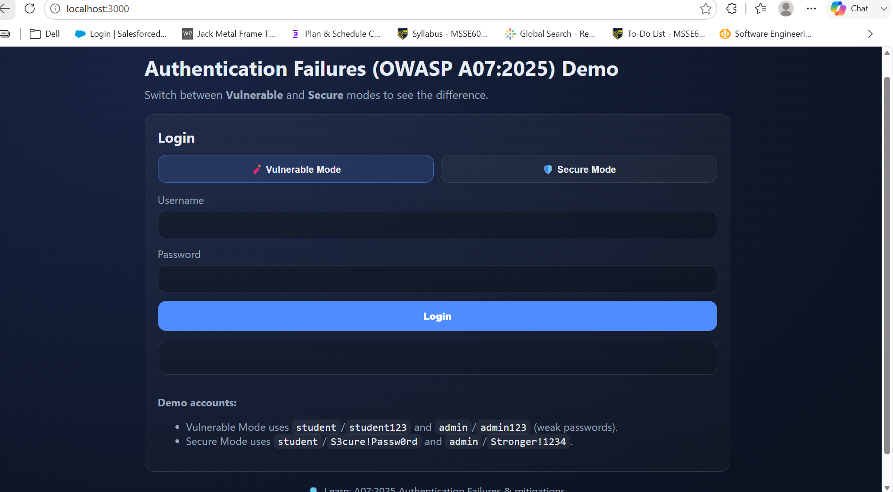
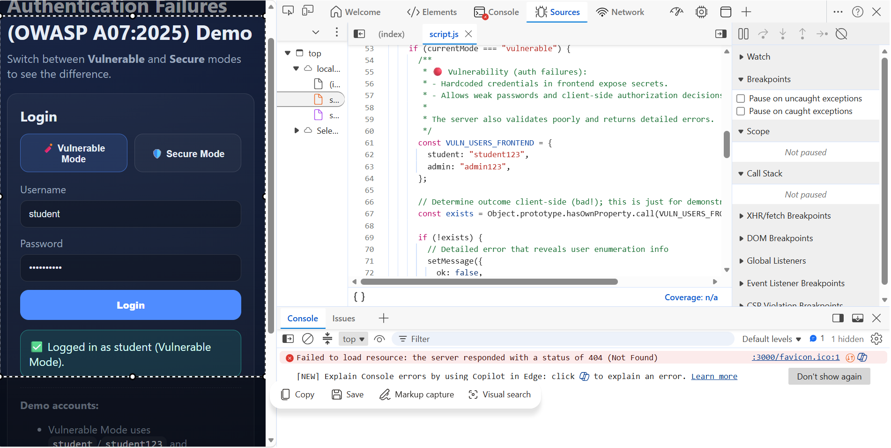
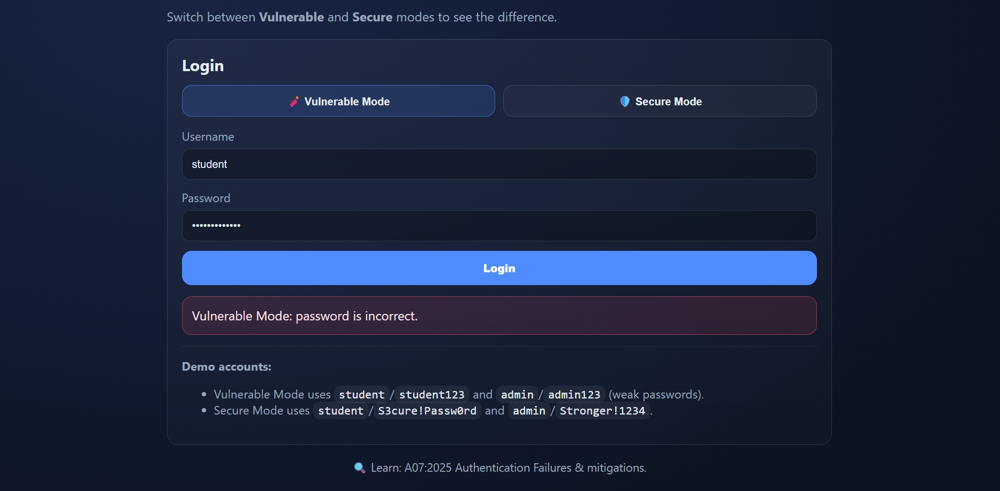
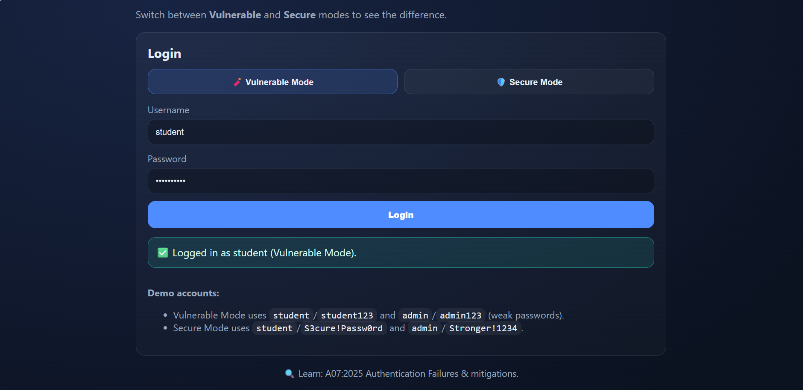
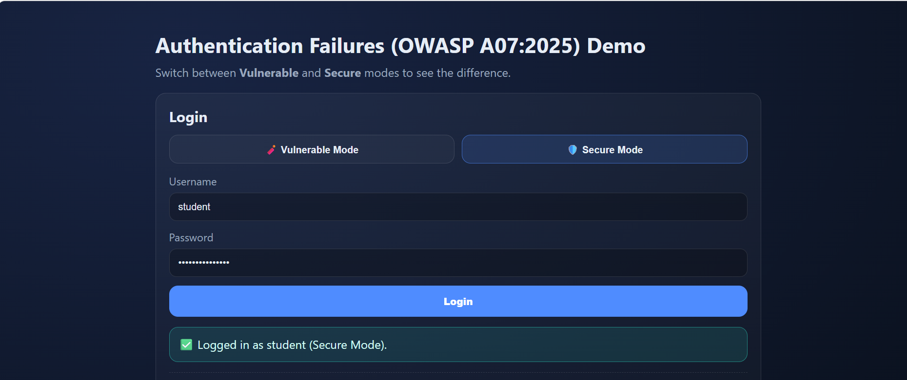
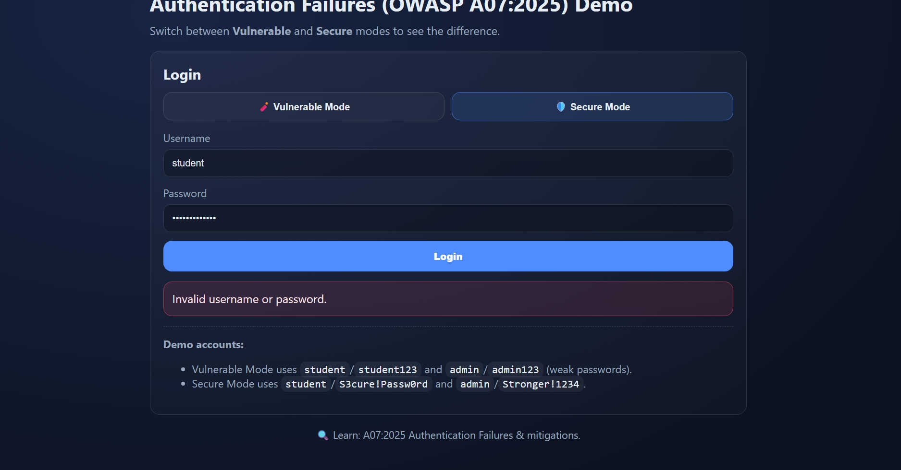
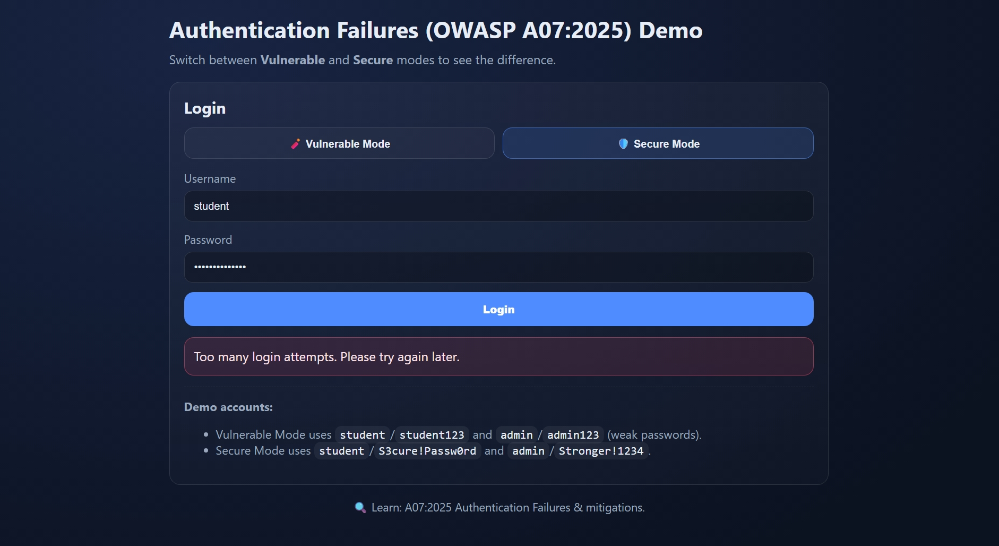
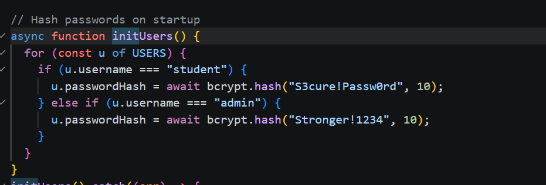

# Vibe Coding Assignment 3  
### Authentication Failures (OWASP A07:2025) Demo  
### MSSE 642 – Summer 2026  
### Student Name: Anusha Reddy
### Professor Name: Randall Granier

---

## 📌 Overview

This project demonstrates **Authentication Failures**, aligned with **OWASP A07:2025**, by implementing two contrasting modes:

- **Vulnerable Mode** – intentionally insecure authentication to illustrate common failures.
- **Secure Mode** – corrected, secure authentication using hashing, generic errors, and rate limiting.

The goal is to show how weak authentication practices lead to exploitation and how proper controls mitigate these risks.

---

## 🤖 Agentic Tool Usage (OpenAI / Claude)

This assignment was built using an **agentic AI workflow**, where the model generated:

- The Express server (`server.js`)
- Frontend logic (`script.js`)
- Vulnerable Mode logic
- Secure Mode logic
- Password hashing implementation
- Rate limiting
- Strong password rules
- Testing instructions

The AI also provided iterative troubleshooting support during setup and execution.

---

## 🔐 OWASP A07:2025 – Authentication Failures

This vulnerability occurs when authentication mechanisms are:

- Weak  
- Exposed  
- Predictable  
- Missing rate limiting  
- Using plaintext or weak passwords  
- Revealing too much information in error messages  
- Implemented on the client instead of the server  

This project demonstrates **exactly** these issues in Vulnerable Mode and fixes them in Secure Mode.

---

# 🟥 Vulnerable Mode (Intentionally Insecure)

### 🔴 Characteristics
- Hardcoded credentials in the frontend  
- Client-side authentication decisions  
- Weak passwords (`student123`, `admin123`)  
- Detailed error messages (user enumeration)  
- No hashing  
- No rate limiting  

---

## 📸 Screenshots (Vulnerable Mode)

### 1. Vulnerable Login Page  


### 2. Hardcoded Credentials in `script.js`  


### 3. Detailed Error Messages  


### 4. Weak Password Login Success  


---

# 🟩 Secure Mode (Proper Authentication)

### 🟢 Characteristics
- Server-side authentication  
- Bcrypt password hashing  
- Generic error messages  
- Rate limiting  
- Strong password rules  
- No credentials in frontend  
- Timing‑safe comparisons  

---

## 📸 Screenshots (Secure Mode)

### 5. Secure Login Page  


### 6. Generic Error Message  


### 7. Rate Limiting  


### 8. Hashed Passwords in `server.js`  


---

# 🧪 Testing Summary

### ✔ Vulnerable Mode Tests
- Login with weak passwords  
- Trigger detailed error messages  
- View hardcoded credentials in DevTools  
- Observe client-side authentication logic  

### ✔ Secure Mode Tests
- Login with strong passwords only  
- Trigger generic error messages  
- Trigger rate limiting after 5 failed attempts  
- View bcrypt hashing in backend (`server.js`)  

---

# 🧠 What I Learned

- Why client-side authentication is dangerous  
- How attackers exploit detailed error messages  
- How bcrypt hashing protects passwords  
- How rate limiting prevents brute-force attacks  
- How to separate frontend and backend responsibilities  
- How to use AI tools to generate secure and insecure patterns intentionally  

---

# 🚀 How to Run the Project

```bash
npm install
node server.js
