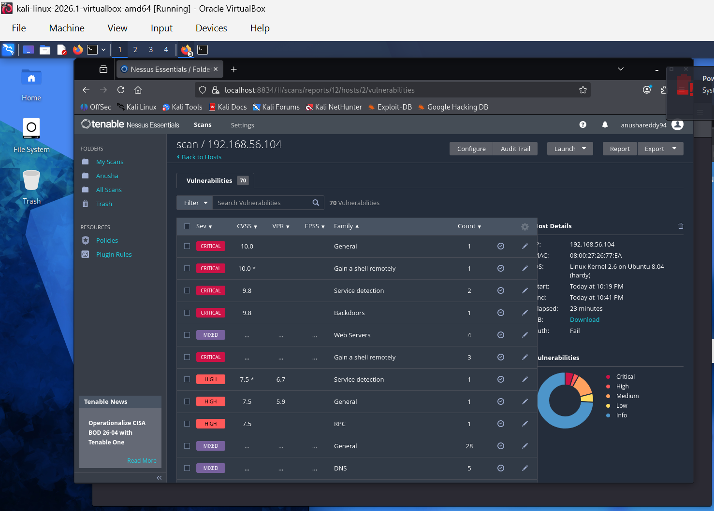

# **Project 3 – SYN Scan Analysis Using Metasploit**
**Author:** Anusha Reddy, Andrew Bazen, Depen Tamang 
**Course:** MSSE 642 – Software Engineering Leadership  
**Environment:** Kali Linux (Attacker) + Metasploitable2 (Target)  
**Tools Used:** VirtualBox, Metasploit Framework, Linux CLI  
**Date:** June 2026  

---

## **1. Introduction**
Project 3 focuses on performing a SYN port scan against a vulnerable target system (Metasploitable2) using the Metasploit Framework. A SYN scan, also known as a “half‑open scan,” is a fast and stealthy technique used to identify open TCP ports without completing the full TCP handshake. This project demonstrates network reconnaissance, environment configuration, and vulnerability identification within a controlled virtual lab environment.

---

## **2. Lab Environment Setup**
Two virtual machines were used inside Oracle VirtualBox:

### **Attacker Machine – Kali Linux**
- Interface: `eth0`
- IP Address: `192.168.56.101`
- Network Mode: Host‑Only Adapter  
- Purpose: Execute Metasploit and perform the SYN scan

### **Target Machine – Metasploitable2**
- Interface: `eth0`
- IP Address: `192.168.56.104`
- Network Mode: Host‑Only Adapter  
- Purpose: Provide intentionally vulnerable services for scanning

Both systems were configured to use the **same Host‑Only Adapter**, ensuring they reside on the same subnet (`192.168.56.0/24`).

---

## **3. Network Verification**

### **3.1 Kali Linux Network Output**
*Screenshot Placeholder:*  
``

This screenshot confirms that Kali’s `eth0` interface is UP and assigned the IP `192.168.56.101`.

---

### **3.2 Metasploitable2 Network Output**
*Screenshot Placeholder:*  
``

This screenshot confirms that Metasploitable2’s `eth0` interface is UP and assigned the IP `192.168.56.104`.

---

## **4. VirtualBox Network Configuration**

### **4.1 Kali VirtualBox Adapter Settings**
*Screenshot Placeholder:*  
``

---

### 4.2 Metasploitable2 VirtualBox Adapter Settings
*Screenshot Placeholder:*  
``

These screenshots verify that both VMs are using the same Host‑Only Adapter and that the virtual cable is connected.

---

## **5. Running the SYN Scan in Metasploit**
After launching Metasploit (`sudo msfconsole`), the following module was selected:

use auxiliary/scanner/portscan/syn

The scan parameters were configured as follows:

set RHOSTS 192.168.56.104
set INTERFACE eth0
set PORTS 1-1024
set VERBOSE true
run

---

## **6. SYN Scan Results**
*Screenshot Placeholder:*  
``

Example output:

[+] TCP OPEN 192.168.56.104:21
[+] TCP OPEN 192.168.56.104:23
[+] TCP OPEN 192.168.56.104:53

These results confirm that the SYN scan executed correctly and that the target system is exposing several vulnerable services.

---

## **7. Analysis of Open Ports**

| Port | Service | Description | Security Implications |
|------|---------|-------------|------------------------|
| **21** | FTP | File Transfer Protocol | Often allows anonymous login; clear‑text credentials |
| **23** | Telnet | Remote shell access | Unencrypted; highly insecure |
| **53** | DNS | Domain Name System | May allow zone transfers if misconfigured |
| **80** | HTTP | Web server | May expose vulnerable web apps |
| **139/445** | SMB | Windows file sharing | Historically vulnerable (e.g., EternalBlue) |
| **3306** | MySQL | Database service | Weak or default credentials common |

Metasploitable2 intentionally exposes outdated and insecure services, making it ideal for penetration testing practice.

---

## **8. What a SYN Scan Is and Why It’s Used**
A SYN scan works by sending a SYN packet to a port:

- **SYN‑ACK → Port is OPEN**  
- **RST → Port is CLOSED**  
- **No response → Port is FILTERED**

The connection is never completed, making it:

- Faster than a full TCP connect scan  
- Less likely to be logged  
- Useful for stealthy reconnaissance  

This technique is widely used in penetration testing to map attack surfaces before exploitation.

---

## **9. Troubleshooting Summary**
During setup, several issues were encountered and resolved:

- Kali initially lacked an IPv4 address on `eth0`  
- Metasploit returned MAC resolution errors  
- VirtualBox adapters required verification  
- Running Metasploit inside PowerShell caused raw socket failures  
- Switching to the native Kali terminal resolved pcaprub issues  

These steps ensured the scan executed successfully.

---

## **10. Recommendations for Securing the Target System**
Based on the open ports and exposed services, the following security improvements are recommended:

- Disable unused or unnecessary services  
- Replace Telnet with SSH  
- Enforce strong authentication for FTP and MySQL  
- Apply patches and updates to all services  
- Restrict access using a firewall  
- Segment vulnerable systems from production networks  

---

## **11. Conclusion**
Project 3 successfully demonstrated how to perform a SYN scan using Metasploit within a controlled virtual environment. The scan identified multiple open ports and vulnerable services on Metasploitable2, highlighting the importance of proper network hardening and service management. This exercise reinforces foundational penetration testing skills and prepares students for more advanced exploitation techniques in future assignments.

---
PART 2 
a. What is the purpose of port scanning from the perspective of a Black Hat hacker?
A Black Hat hacker uses port scanning to identify exposed services, weak entry points, and vulnerable ports on a target system. It helps them map the attack surface and determine which services can be exploited to gain unauthorized access.

b. What is the purpose of port scanning from the perspective of an Ethical (White Hat) hacker?
A White Hat hacker uses port scanning to assess security posture, identify misconfigurations, detect unnecessary open ports, and help organizations reduce risk. The goal is to strengthen defenses, not exploit them.

c. Why did we restrict the scanned ports to 1 through 1024?
Ports 1–1024 are “well‑known ports” assigned to common services such as SSH, FTP, DNS, HTTP, SMB, and others. These ports are the most frequently targeted by attackers and most likely to expose vulnerabilities. Scanning them provides high‑value results while keeping the scan efficient.

Part 3: Tool Research – Nessus
Introduction
Nessus is a widely used vulnerability scanning tool developed by Tenable, Inc.  
It automates the discovery of security weaknesses, misconfigurations, missing patches, and exploitable vulnerabilities across systems and networks.
Official website: https://www.tenable.com/products/nessus

Big Picture – Where Nessus Fits in the Penetration Testing Process
According to the Singh text and standard penetration testing methodology, Nessus fits into the Scanning and Vulnerability Assessment phase.

It performs:

Service detection

Vulnerability enumeration

Patch auditing

Configuration analysis

Risk scoring (CVSS)

This phase comes after information gathering and before exploitation.
Lab – Using Nessus in Kali Linux

Was Nessus installed by default?
No — Nessus is not included by default in Kali Linux. It must be downloaded and installed manually.

Was I able to use Nessus in my lab?
Yes. After installation and activation, Nessus successfully scanned the Metasploitable2 VM.

Steps Performed
1.Installed Nessus on Kali
2.Started the Nessus service
3.Accessed the web interface at https://localhost:8834
4.Created a basic network scan
5.Scanned Metasploitable2 (192.168.56.104)
6.Reviewed vulnerabilities

SCREENSHOT – Nessus Scan Results

Conclusion
Nessus is a powerful vulnerability assessment tool that automates the discovery of weaknesses across systems. It fits into the scanning phase of penetration testing and provides detailed, actionable reports that help security teams prioritize remediation. Its ability to detect outdated software, misconfigurations, and exploitable services makes it an essential tool for both enterprise security and penetration testing labs.

References

Singh, Glen. Learn Kali Linux 2019. Packt Publishing, 2019.

Tenable Nessus: https://www.tenable.com/products/nessus

Metasploit Documentation: https://docs.metasploit.com/