# Project 4 — Penetration Testing, Part 2 (Web Application Deep Dive)

**Course:** MSSE 642
**Application:** Hiking Club Application
**Group members:** Andrew Bazen, Depen Tamang, Anusha Reddy

### References

- Singh, G. (2019). *Learn Kali Linux 2019* (esp. Chapters 14–15). Birmingham, UK: Packt Publishing.
- OWASP Foundation. *OWASP ZAP (Zed Attack Proxy).* <https://www.zaproxy.org/>
- The hiking club application built for this assignment lives in this repo at
  [`code/hiking-club-app/`](../../code/hiking-club-app/), and implements the design
  from our [Project 2 threat model](./project-2-threat-model.md).

---

## Scenario

The Hiking Club was hit by a ransomware attack and, rather than pay, decided to
rebuild their website from scratch. Our consulting company was hired to perform
penetration testing on the new site. The threat model was developed in Project 2;
this document develops the **web-application penetration testing procedure** our
testers will follow, then rebuilds the application, deploys it in our isolated
pen-testing lab, and tests it with OWASP ZAP.

---

## Part 1 — Web Application Penetration Testing Procedure

## Website Penetration Testing — Summary Table

The table below summarizes the two web penetration testing phases covered in Chapters 14 and 15 of *Learn Kali Linux 2019*, with the primary tool used in each phase.

| **PHASE** | **DESCRIPTION** | **TOOL SELECTED** |
|-----------|------------------|-------------------|
| **Reconnaissance / Information Gathering (Ch. 14)** | Identify the web application's attack surface by mapping endpoints, directories, files, and hidden resources. This phase is low-impact and sets the foundation for later testing by revealing potential entry points and sensitive assets. | **Gobuster** |
| **Exploit Verification / Gaining Access (Ch. 15)** | Actively test authentication, input validation, session controls, and discovered weaknesses to determine whether unauthorized access or data exposure is possible. This phase validates the real risk of the vulnerabilities found during reconnaissance. | **OWASP ZAP** |

---

## Tool Description and Analysis

Below are the required tool write‑ups, formatted exactly as the assignment specifies.

---

### Gobuster

#### Vendor Website  
https://www.kali.org/tools/gobuster/

#### Description (3 sentences)  
Gobuster is a fast and lightweight command‑line tool used for brute‑forcing directories, files, DNS subdomains, and virtual hosts on web servers. It uses wordlists to enumerate hidden paths and resources that are not publicly linked or visible through normal browsing. Because it is written in Go, Gobuster is extremely fast and efficient, making it ideal for large‑scale or time‑sensitive reconnaissance.

#### Included in Kali Linux 2019?  
Yes — Gobuster is included by default in Kali Linux (including the 2019 release).

#### How it would be used to test the Hiking Club Application  
For the Hiking Club Application, Gobuster would be used during the information‑gathering phase to enumerate hidden directories and files such as `/admin`, `/backup`, `/private`, or `/dev`. These locations may contain sensitive configuration files, outdated code, or administrative interfaces that are not intended for public access. By discovering these hidden endpoints, Gobuster helps identify potential attack vectors that could later be exploited during the gaining‑access phase, such as exposed login pages, forgotten development routes, or misconfigured directories that leak sensitive information.

---

### OWASP ZAP (Zed Attack Proxy)

#### Vendor Website  
https://www.zaproxy.org/

#### Description (3 sentences)  
OWASP ZAP is an open‑source web application security scanner used to identify vulnerabilities in web applications. It functions as an intercepting proxy, allowing testers to capture, modify, and replay HTTP requests to analyze how the application handles user input. ZAP also includes automated scanning capabilities that detect common vulnerabilities such as SQL injection, cross‑site scripting (XSS), authentication flaws, and insecure configurations.

#### Included in Kali Linux 2019?  
Yes — OWASP ZAP is included by default in Kali Linux.

#### How it would be used to test the Hiking Club Application  
For the Hiking Club Application, OWASP ZAP would be used during the gaining‑access phase to actively test for vulnerabilities. By intercepting and modifying requests, ZAP allows testers to probe for weaknesses in authentication, session management, and input validation. Automated scans can identify issues such as SQL injection, XSS, insecure cookies, and weak session tokens. This helps determine whether an attacker could gain unauthorized access to user accounts, manipulate hiking event data, or compromise sensitive information stored by the application.


## Part 2 — Coding the Application with Agentic Tools

### Agentic tool used

We built the site with **Claude Code**, an agentic command-line coding tool. We
chose an agentic tool that writes directly to local source files specifically because the assignment requires us to **keep
full control of the code** so we can clone it onto a VM in our pen-testing lab.
Every file the agent produced lives in version control in this repository under
[`code/hiking-club-app/`](../../code/hiking-club-app/), so the exact same code we
tested locally is what we deployed and scanned.

### What we built

A small, server-rendered web application for a community hiking club. It is
deliberately **normal, functional application code** and no intentional
vulnerabilities were planted so that the OWASP ZAP scan in Part 4 reflects the
real security posture of a from-scratch build.

**Tech stack**

- Python 3 + [Flask](https://flask.palletsprojects.com/) with Jinja2 templates
- SQLite via the standard-library `sqlite3` module
- [Werkzeug](https://werkzeug.palletsprojects.com/) for password hashing
- Plain CSS

**Roles (mapped from the Project 2 threat model)**

| Role | Logged in? | Can do |
|------|------------|--------|
| Guest | No | View the public list of upcoming events. |
| Member | Yes | Register/log in, view & edit **their own** profile, browse and register for events, see "My Events". |
| Admin | Yes | Everything a member can, plus create events and view the member list. |

**Security choices made during the build**

- Passwords are hashed with Werkzeug, never stored in plaintext.
- Authorization is enforced **server-side** on every protected route via
  `@login_required` / `@admin_required` decorators.
- The profile route keys off the **session user id only** — there is no user id in
  the URL — so one member cannot view or edit another member's profile (IDOR).
- Jinja2 auto-escaping (on by default) protects rendered output from reflected XSS.
- Login returns the **same error** for "no such email" and "wrong password" so the
  form does not reveal which emails are registered.
- The post-login `next` redirect only accepts internal paths (starts with `/`) to
  prevent open-redirect abuse.

### How we coded it / issues we ran into

- **Collapsing the 3-tier design to one host.** The Project 2 architecture diagram
  shows a 3-tier cloud topology (perimeter firewall → public web subnet → internal
  firewall → private DB subnet inside a VPC). For a single-VM lab target we
  intentionally collapsed this onto one host: the separate private-subnet database
  became a local SQLite file in the same Flask process. The network isolation,
  firewalls, and TLS from the diagram are deployment/infrastructure concerns handled
  at the VM/lab level, not in the application code.
- **Dated seed data.** Events are seeded relative to "today" (`date.today()`), so the
  public home page always shows upcoming events no matter when the app is run or
  re-seeded.
- **First-run bootstrap.** `app.py` auto-creates and seeds `hiking.db` on first run
  if it is missing, so a fresh clone "just works" on the VM without a manual DB step.
- **Dev server caveat.** The app runs on Flask's built-in development server bound to
  `0.0.0.0:5000`. That is appropriate for an isolated lab target but is not a
  production server.

### Verifying the app is running

We exercised every route and confirmed server-side authorization behaves as
designed: protected routes redirect guests to the login page (HTTP 302), a logged-in
**member** is forbidden (HTTP 403) from the admin dashboard, and the **admin**
reaches it (HTTP 200). The screenshots below show the application running **locally**
at `http://localhost:5000` (the same build later deployed to the lab VM in Part 3).

**Screen Shot 1 — Public home page (upcoming events)**

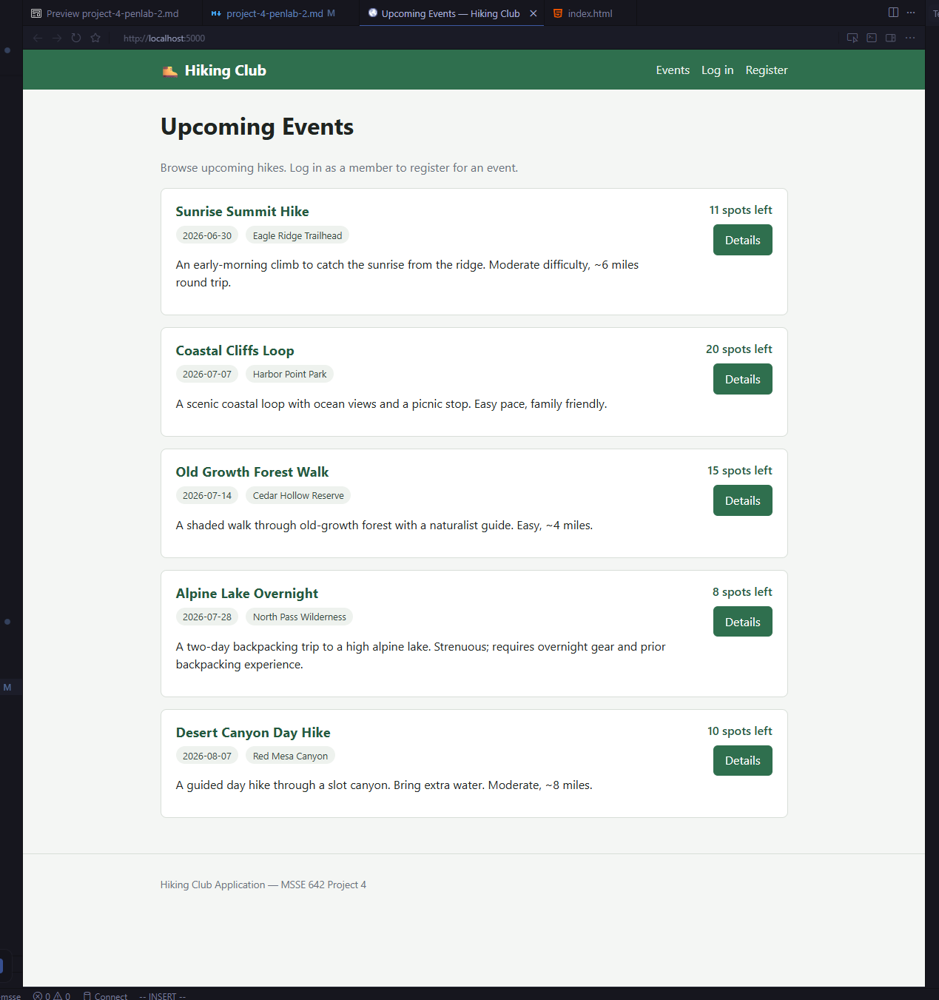

> Shows the public **Upcoming Events** page listing the five seeded events, each with
> its date, location, and remaining spots, plus the Guest navigation.

**Screen Shot 2 — Login page**

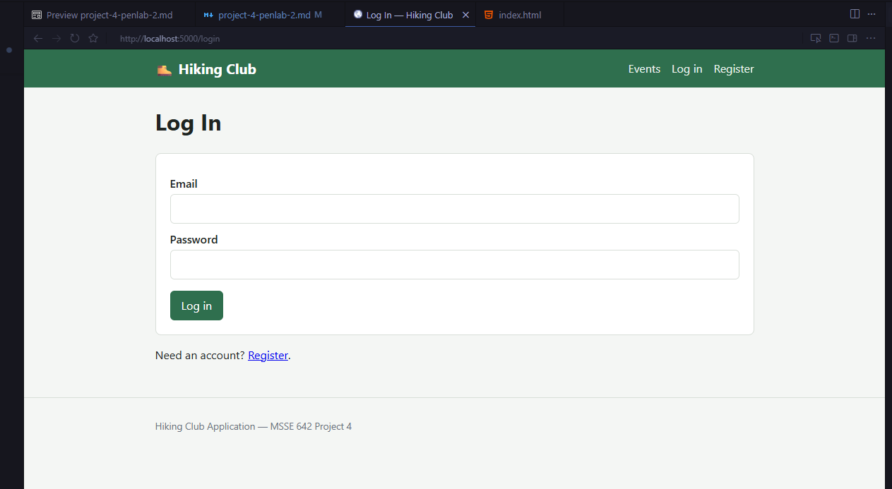

> Shows the `/login` form (email + password). The browser address bar confirms the
> app is running locally at `http://localhost:5000/login`.

**Screen Shot 3 — Admin dashboard (logged in as admin)**

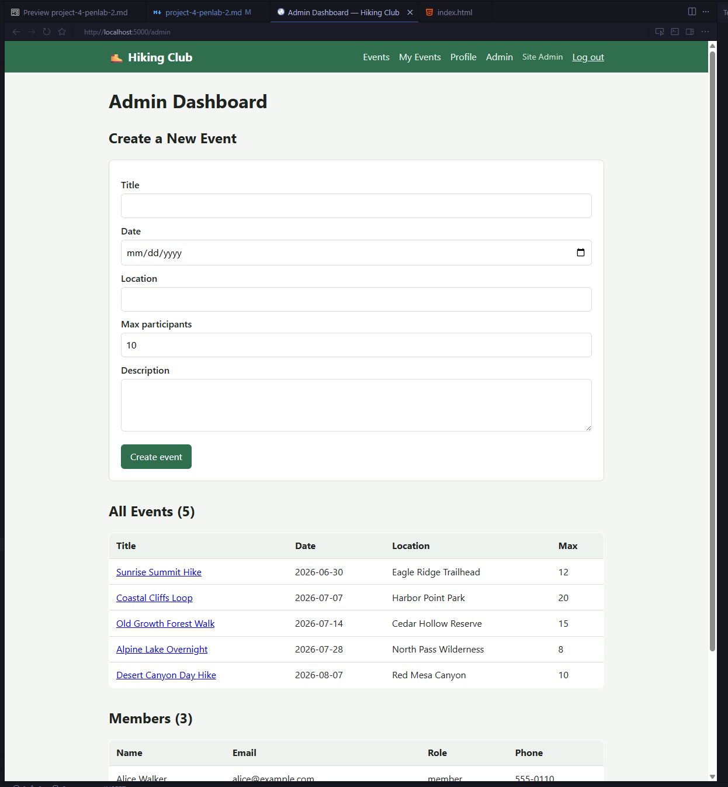

> Shows the admin-only dashboard reached as `admin@hikingclub.test`.

**Screen Shot 4 — Member view (profile)**

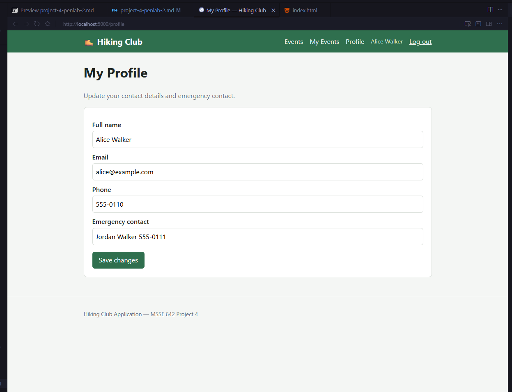

> Shows "My Profile" logged in as the member Alice Walker.

---

## Part 3 — Deployment on a VM in the Pen-Testing Lab

To stay consistent with our Project 3 lab, we deployed the application on a **new
Ubuntu Server VM in VirtualBox**, attached to the same **host-only network
(`10.10.10.0/24`)** that already hosts our Kali attacker VM. This keeps the target
isolated from the internet while letting Kali reach it directly.

### Target VM details

| Item | Value |
|------|-------|
| Hypervisor | Oracle VirtualBox |
| Guest OS | Ubuntu Server 22.04 LTS |
| Network adapter | Host-only, `10.10.10.0/24` |
| Target IP | `10.10.10.6` |
| App URL | `http://10.10.10.6:5000` |
| Kali attacker | same host-only network (e.g. `10.10.10.5`) |

### Deployment steps

```bash
# --- On the new Ubuntu VM ---

# 1. Update and install the runtime + tooling
sudo apt update
sudo apt install -y python3 python3-venv python3-pip git

# 2. Pull the exact code we built in Part 2
git clone <this-repo-url> regis-msse
cd regis-msse/code/hiking-club-app

# 3. Create an isolated environment and install dependencies
python3 -m venv .venv
source .venv/bin/activate
pip install -r requirements.txt

# 4. Seed a known-good database, then run the app
python3 seed.py          # creates and seeds hiking.db
python3 app.py           # binds to 0.0.0.0:5000

# (Optional) allow the port if a host firewall is enabled
sudo ufw allow 5000/tcp
```

Confirm the host-only adapter address on the VM:

```bash
ip addr show            # note the 10.10.10.x address on the host-only interface
```

Then, **from the Kali VM**, confirm reachability before any testing:

```bash
curl http://10.10.10.6:5000/
```

> **Containerized alternative.** The repo also includes a `Dockerfile`. On a VM with
> Docker installed, the same app can be deployed with
> `docker build -t hiking-club . && docker run --rm -p 5000:5000 hiking-club`. We
> deployed on a bare VM (above) to keep the target environment simple and
> transparent for scanning.

### Problems we ran into

- **Host-only IP assignment.** The VM has to be on the **host-only** adapter (not
  NAT) for Kali to reach it directly; on NAT the guest is reachable from the host but
  not from a second VM. We confirmed the `10.10.10.x` address with `ip addr` before
  testing.
- **Dev server prints the NAT address, not the host-only one.** Because the VM has
  two adapters (host-only + NAT), Flask's startup banner reported
  `Running on http://10.0.3.15:5000` — the **NAT** address. That is cosmetic: binding
  to `0.0.0.0` means it is *also* listening on the host-only `10.10.10.6` address, which
  is the one Kali uses for all testing. We confirmed the host-only address with
  `ip addr` and verified reachability with `curl` from Kali.
- **Single-process dev server.** Flask's dev server is single-threaded, so a heavy
  ZAP active scan can slow it down. We run discovery and scanning **one tool at a
  time** to keep results clean.

**Screen Shot 5 — Target VM running in VirtualBox**

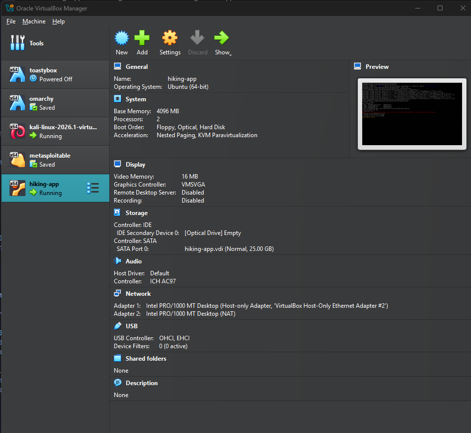

> Shows the VirtualBox Manager with the `hiking-app` Ubuntu VM **Running** (alongside
> the Kali VM). The Network panel confirms the two adapters used: **Adapter 1
> Host-only** (for Kali-to-target traffic) and **Adapter 2 NAT** (for installing
> packages).

**Screen Shot 6 — App serving on the VM**

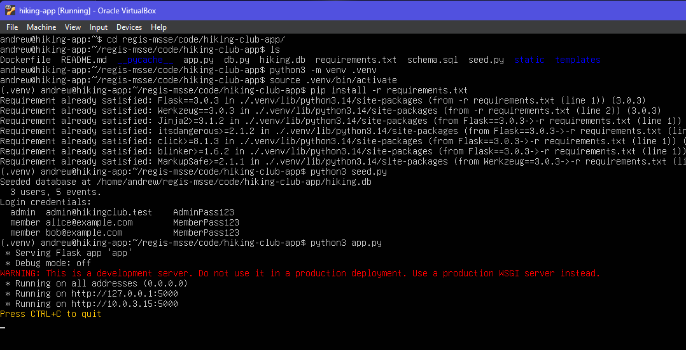

> Shows the VM terminal running `seed.py` (3 users, 5 events) and then `python3
> app.py`. Flask reports it is serving on `0.0.0.0` (banner shows the NAT address
> `10.0.3.15:5000`; it also listens on the host-only `10.10.10.6` — see the note
> above).

**Screen Shot 7 — Reaching the target from Kali**


> Shows `curl http://10.10.10.6:5000/` run from the Kali VM returning the app's HTML
> home page, confirming the target is reachable across the host-only network before
> any scanning begins.

---

## Part 4 — Penetration Testing

To fufill the information gathering for the app, we originally were going to use DirBuster,
however, it continually failed with errors before finishing.  To rectify this, we decided to 
switch to gobuster, which is a more stable tool.

The full step-by-step commands are documented in the app's
[README](../../code/hiking-club-app/README.md#penetration-testing-from-kali-dirbuster--owasp-zap).

### Information gathering — content discovery with gobuster

gobuster brute-forces paths from a wordlist to reveal routes that are not linked in
the UI. We ran it from Kali against the deployed target:

```bash
gobuster dir -u http://10.10.10.6:5000 \
  -w /usr/share/dirb/wordlists/common.txt \
  -t 3 --timeout 30s
```

We tuned the command to suit the single-process Flask dev server: the smaller
`common.txt` wordlist, a low concurrency of `-t 3`, and a longer `--timeout 30s`. An
earlier run with the larger `directory-list-2.3-medium.txt` at higher concurrency
overwhelmed the server and produced request timeouts, so we scaled it back for a
clean run.

**Screen Shot 8 — gobuster running against the target**

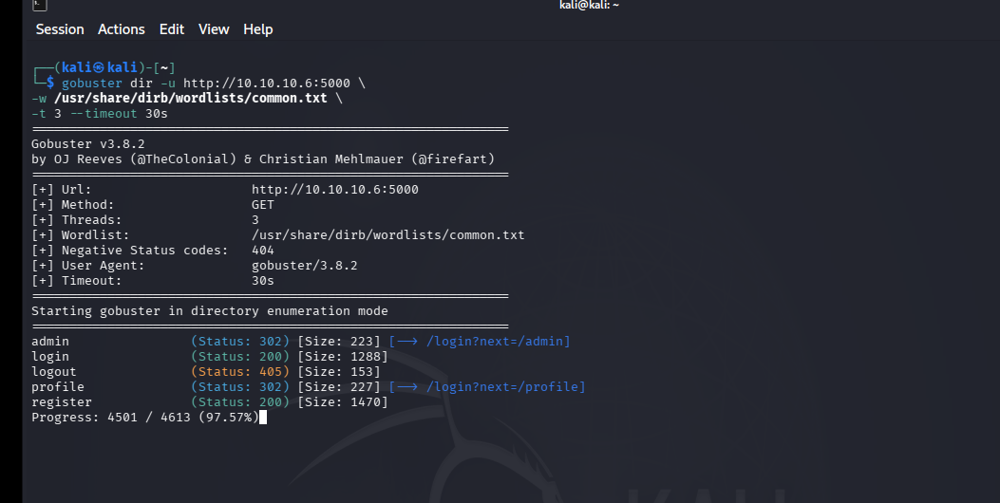

> Shows gobuster running against `http://10.10.10.6:5000` with the scan in progress.

**Screen Shot 9 — gobuster results**

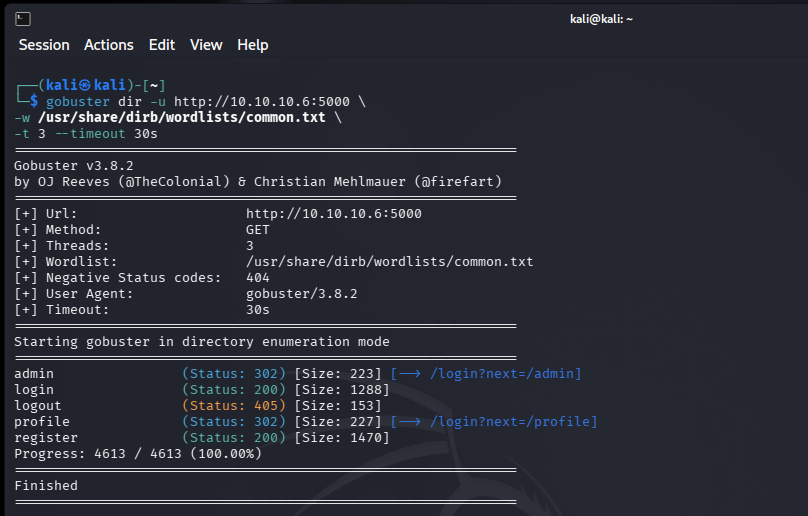

> Shows the completed gobuster output.

### Gaining access — OWASP ZAP

We tested the deployed app from Kali with **OWASP ZAP**, running both an
unauthenticated automated scan and an authenticated scan.

#### a) Unauthenticated automated scan

1. Launch ZAP on Kali: `zaproxy`.
2. **Quick Start → Automated Scan.**
3. URL to attack: `http://10.10.10.6:5000` → **Attack**.
4. Review the **Alerts** tab

#### b) Authenticated scan (covers member/admin pages)

To reach logged-in pages we configured form-based authentication in a ZAP Context:

- **Login Form Target URL:** `http://10.10.10.6:5000/login`
- **Login Request POST Data:** `email=&password=`
- **Logged-in indicator (regex):** `Log out` • **Logged-out indicator:** `Log in`
- Add two Users — the **member** creds and the **admin** creds — then **Spider** and
  **Active Scan** as each user to exercise both roles.

#### ZAP scan results

We ran the active scan with the **Pen Test** scan policy (high strength), which is
more aggressive than the Dev/QA policies and exercises the injection rules fully. ZAP
reported two High-severity injection alerts plus a set of configuration findings. The
results below are reported as ZAP raised them, each with a standard remediation.

| Finding | Severity | Notes / Remediation |
|---------|----------|---------------------|
| SQL Injection (`/register`, parameter `name`) | High | ZAP's active scanner flagged boolean-based SQL injection (conditions `AND 1=1` / `AND 1=2`). Remediation: use parameterized queries / prepared statements for all user-supplied input and add server-side input validation. |
| Path Traversal | High | ZAP flagged a potential directory-traversal payload on a request parameter. Remediation: validate and canonicalize any user input before it touches the filesystem, and avoid mapping user input to file paths. |
| Absence of Anti-CSRF Tokens | Medium | The POST forms (login, register, profile, event registration, create-event) have no CSRF tokens. Remediation: add per-form CSRF tokens (e.g. Flask-WTF). |
| CSP header not set + missing anti-clickjacking / X-Content-Type-Options headers | Low/Medium | No `Content-Security-Policy`, `X-Frame-Options`, or `X-Content-Type-Options` response headers. Remediation: add security headers (e.g. via a reverse proxy or Flask-Talisman). |
| Server leaks version information via `Server` header | Low | Responses advertise `Server: Werkzeug/3.0.3 Python/3.14.4`, disclosing framework/language versions. Remediation: suppress/override the `Server` header at a reverse proxy. |
| Cookie without `SameSite` attribute | Low | The session cookie lacks the `SameSite` (and `Secure`) flag over plain HTTP. Remediation: set the flags and serve over HTTPS. |

The two High-severity injection alerts should be prioritized first in any remediation
plan, followed by the CSRF and security-header findings. The full alert list and
per-alert detail are shown in the screenshots below.

**Screen Shot 10 — ZAP spider / site tree of the target**

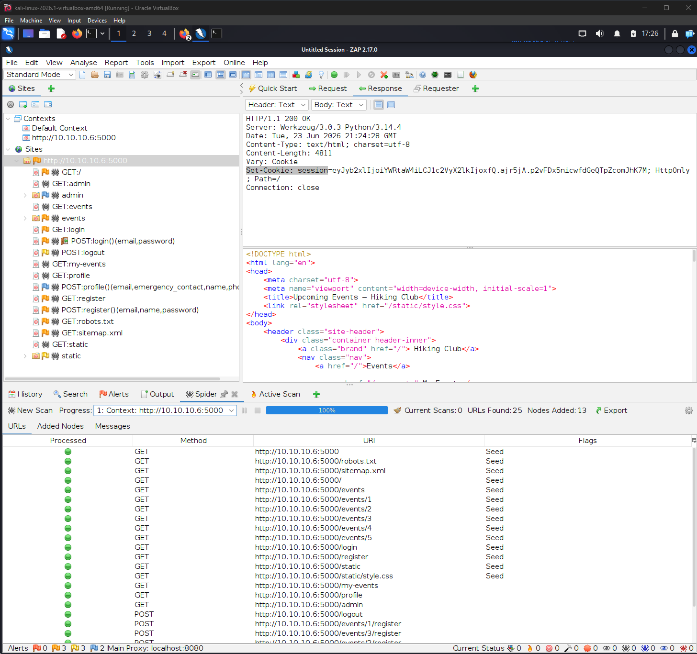

> Shows the ZAP **Sites** tree after spidering `http://10.10.10.6:5000`.

**Screen Shot 11 — ZAP Alerts tab**

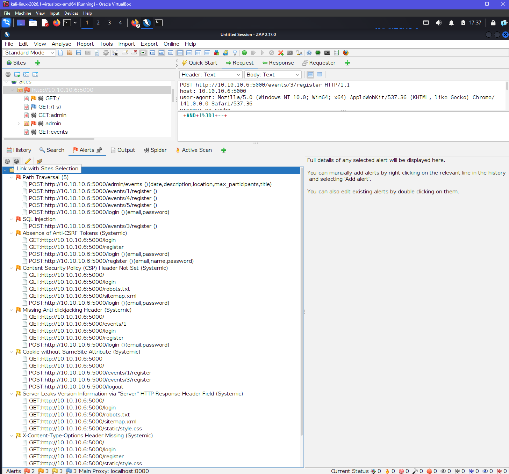

> Shows the **Alerts** tree with the full result set.

**Screen Shot 12 — A specific alert in detail (SQL Injection)**

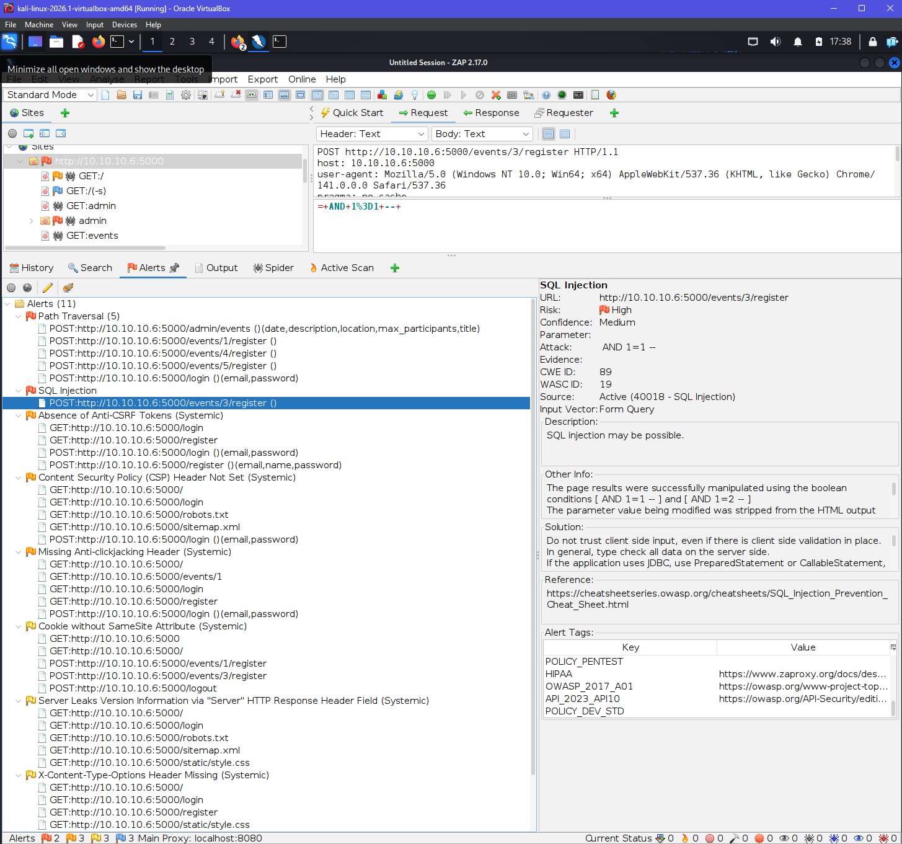

> Shows the **SQL Injection** alert expanded against `/register`.

**Screen Shot 13 — Authenticated active scan**

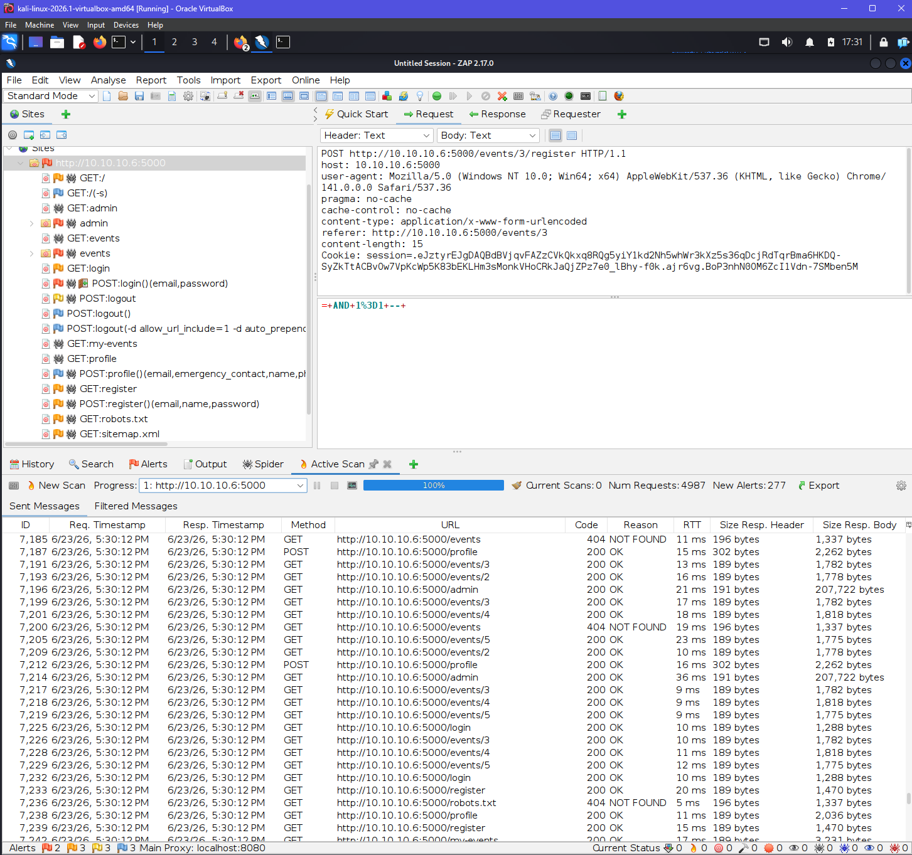

> Shows the **Active Scan** running as an authenticated user.

---

## Conclusion

Starting from the Project 2 threat model, we built the Hiking Club site from
scratch with **Claude Code** to keep the source under our control, deployed it on
an isolated Ubuntu VM in our VirtualBox pen-testing lab, and tested it with OWASP
ZAP from Kali. Using the Pen Test scan policy, ZAP reported two High-severity
injection alerts (SQL Injection and Path Traversal) along with several lower-severity
configuration findings.
